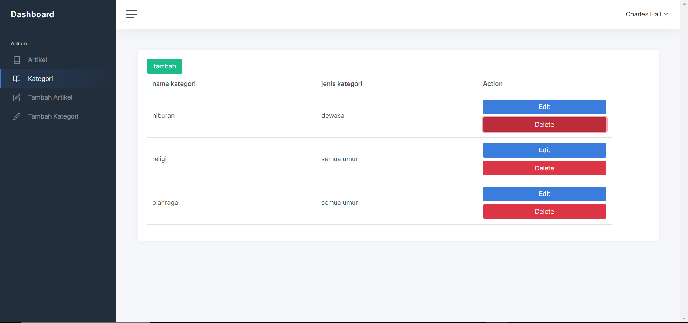
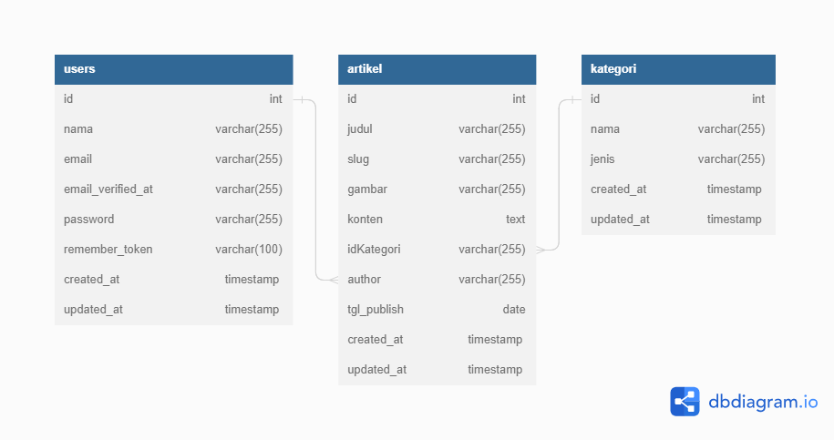

# System Requierment

-   Framework = Laravel 9
-   Programming language = PHP 8.1.10
-   Database = mysql
-   Webserver = Apache
-   Software Development Tool : Laragon, Visual Studio Code, Google Chrome, GIT and DBeaver

# Third Party/ Library

1. Bootstrap
2. Jquery
3. Feather Icon

# User
```
email : gaga@gmail.com
password : 12345678
```
# Dokumentasi

### <p style="text-align: center;">Tampilan Register</p>


### <p style="text-align: center;">Tampilan Login</p>


### <p style="text-align: center;">Tampilan Home Artikel</p>


### <p style="text-align: center;">Tampilan Add Artikel</p>


### <p style="text-align: center;">Tampilan Update Artikel</p>


### <p style="text-align: center;">Tampilan Update Artikel</p>


### <p style="text-align: center;">Tampilan Kategori</p>



### <p style="text-align: center;">Tampilan Insert Kategori</p>


### <p style="text-align: center;">Tampilan Update Kategori</p>


### <p style="text-align: center;">Tampilan Update Kategori</p>


# ERD Database


